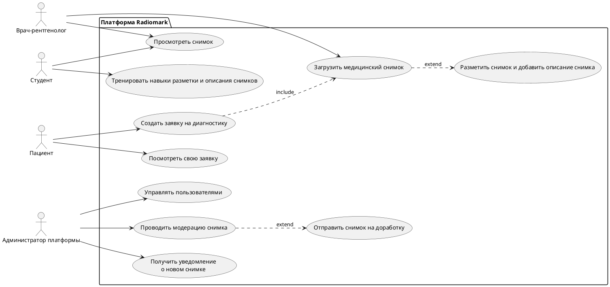
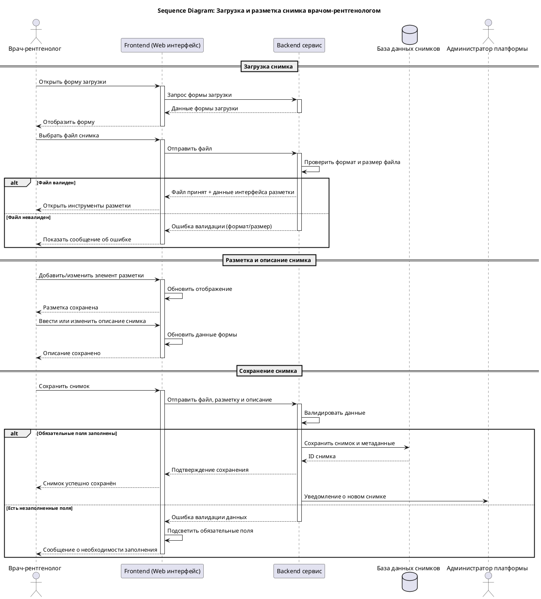

# UML диаграммы Radiomark

## Диаграмма прецедентов (Use Case Diagram)

На диаграмме показаны основные действующие лица платформы и их ключевые сценарии использования.

## Диаграмма последовательности: Загрузка и разметка снимка врачом

На диаграмме показано взаимодействие между врачом, фронтендом, бэкендом, базой данных и администратором в процессе загрузки, разметки и сохранения медицинского снимка.

