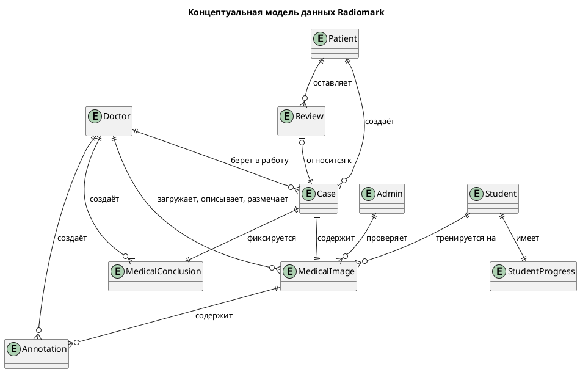
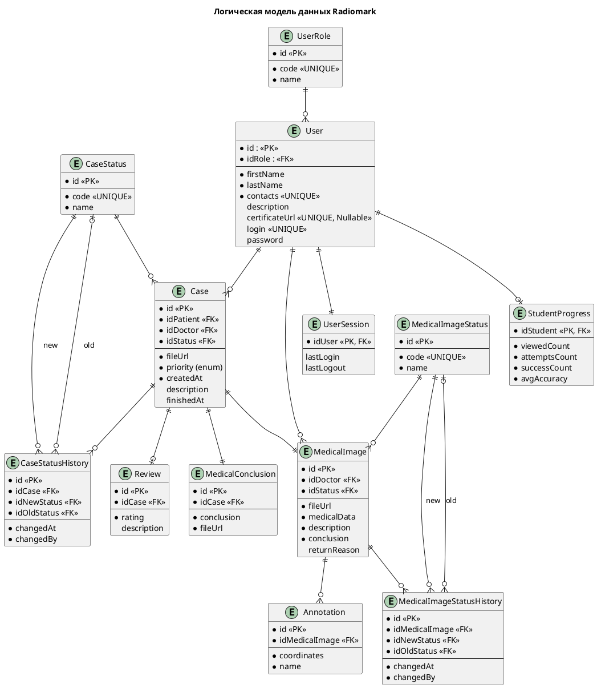
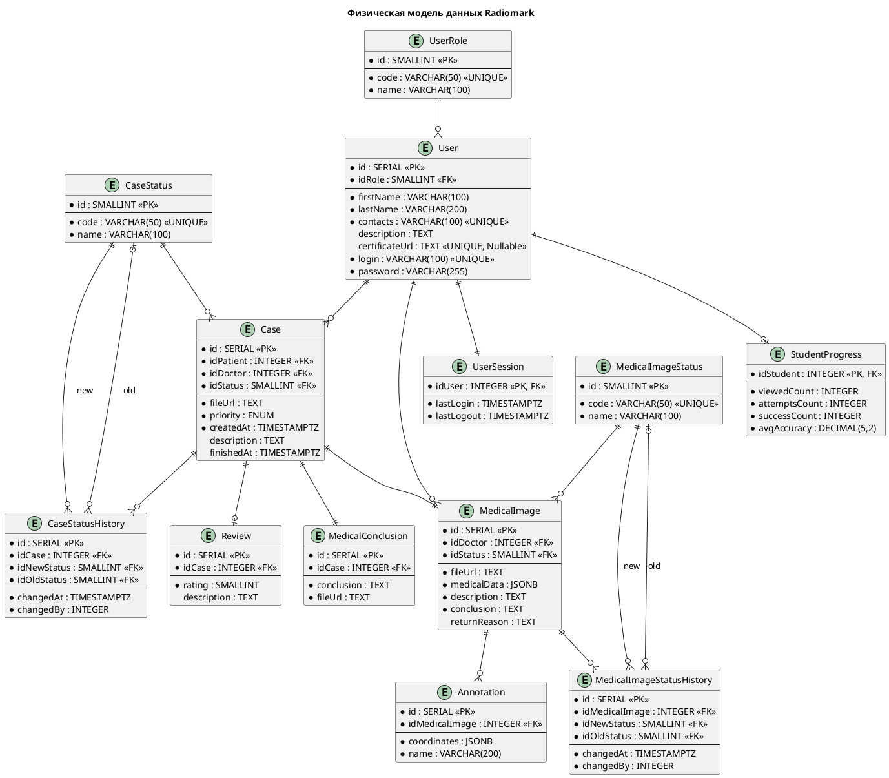

# Модель данных (ERD)

ER-диаграммы описывают структуру данных платформы на трёх уровнях: от бизнес-сущностей до физической реализации в PostgreSQL.

## Концептуальная модель

На концептуальном уровне показаны основные бизнес-сущности и их связи без технических деталей. Диаграмма отражает ключевые роли (врач, пациент, студент, модератор) и основные объекты: заявка, медицинский снимок, разметка, заключение, отзыв, прогресс студента.

📊 Развернуть диаграмму

## Логическая модель

Логическая модель добавляет атрибуты, первичные и внешние ключи, а также справочники статусов и ролей. Здесь появляются таблицы для аудита изменений (история статусов) и разделение часто обновляемых данных (сессии пользователей). Модель нормализована и отражает все бизнес-правила.

📊 Развернуть диаграмму

## Физическая модель (PostgreSQL)

На физическом уровне выбраны конкретные типы данных, индексы и реализованы паттерны:

- **Горячие данные:** таблица `UserSession` для изоляции часто обновляемых полей `lastLogin` и `lastLogout`.
- **Гибкие данные:** поля `coordinates` и `medicalData` используют `JSONB`, что позволяет избежать частых миграций схемы.
- **Предрасчитанные агрегаты:** таблица `StudentProgress` хранит агрегированную статистику тренировок для мгновенного отображения.
- **История изменений:** таблицы `CaseStatusHistory` и `MedicalImageStatusHistory` обеспечивают полный аудит всех переходов статусов.

 

📊 Развернуть диаграмму

## Ключевые решения

| Решение | Описание |
|:--------|:---------|
| **Единая таблица пользователей** | Все роли (врач, пациент, студент, модератор) хранятся в `User` с ссылкой на справочник `UserRole`. Упрощает аутентификацию и связи. |
| **Разделение сессий** | Часто обновляемые `lastLogin`/`lastLogout` вынесены в `UserSession`, чтобы не блокировать основную запись пользователя при каждом входе. |
| **JSONB для гибких данных** | Координаты разметки (`Annotation.coordinates`) и клинические параметры (`MedicalImage.medicalData`) хранятся в JSONB. Это позволяет избежать частых миграций схемы. |
| **История статусов** | Для заявок и снимков ведутся таблицы истории (`CaseStatusHistory`, `MedicalImageStatusHistory`). Обеспечивается полный аудит изменений. |
| **Предрасчитанные агрегаты** | `StudentProgress` хранит агрегированную статистику тренировок, что позволяет мгновенно отображать прогресс без выполнения тяжёлых запросов. |

:::tip[Подробнее о технологиях хранения]
Обоснование выбора PostgreSQL, JSONB и других технологий — в разделе [Технологии хранения](../architecture/storage-technologies).
:::
