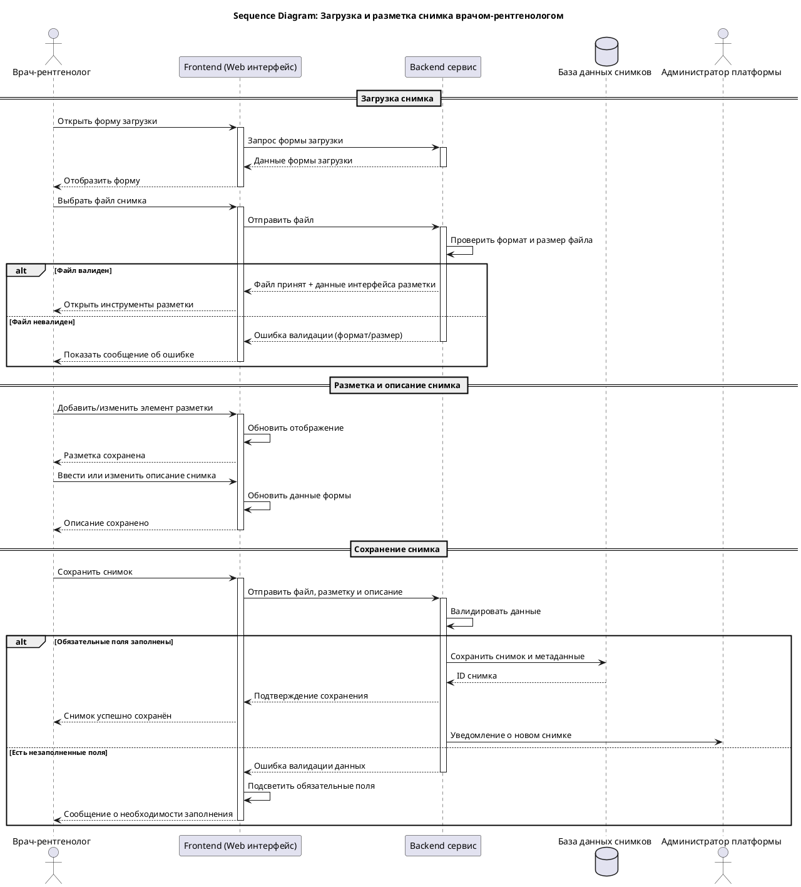

# Диаграмма последовательности: загрузка и разметка снимка

Диаграмма детализирует основной сценарий использования системы врачом-рентгенологом — от открытия формы загрузки до отправки размеченного снимка на модерацию. Она показывает взаимодействие между интерфейсом врача, серверной частью, базой данных и администратором.

Данная последовательность является реализацией прецедента **UC-03: Загрузка, разметка и описание снимка врачом-рентгенологом**.

## Алгоритм

### 1. Открытие формы загрузки
Врач открывает форму загрузки нового снимка. Frontend запрашивает у Backend'а данные для отображения формы (список доступных типов исследований, областей и т.д.).

### 2. Загрузка файла
Врач выбирает файл снимка на устройстве. Frontend отправляет файл на Backend, где происходит первичная проверка:

| Проверка | Допустимые значения |
|:---------|:--------------------|
| **Формат** | DICOM, PNG, JPG |
| **Максимальный размер** | 100 МБ |

- **Файл корректен** → система принимает файл и открывает интерфейс разметки и описания. Переход к шагу 3.
- **Файл невалиден** → система возвращает ошибку с описанием причины. Врач может повторить попытку загрузки.

### 3. Разметка и описание
Врач выполняет графическую разметку структур на снимке и заполняет текстовое описание. Все изменения временно сохраняются на Frontend'е.

### 4. Сохранение снимка
Врач нажимает «Сохранить снимок». Frontend отправляет на Backend файл, координаты разметки и текстовое описание. Backend выполняет финальную валидацию:

| Проверка | Что проверяется |
|:---------|:----------------|
| **Метаданные** | Область тела, диагноз, уровень сложности |
| **Разметка** | Минимум одна размеченная структура |
| **Описание** | Текстовое описание клинического случая |

- **Все поля заполнены** → снимок, разметка и описание сохраняются в БД. Присваивается статус «На модерации». Врач получает уведомление об успехе, администратор — уведомление о новом снимке.
- **Есть незаполненные поля** → Backend возвращает ошибку валидации. Frontend подсвечивает незаполненные поля. Врач возвращается к шагу 3.

:::tip[Примечание]
Администратор получает уведомление о новом снимке только после его успешного сохранения. Полный алгоритм проверки метаданных и разметки описан в таблице решений DMN (раздел [Валидация снимков (DMN)](./dmn-validation)). Детали процесса модерации — в разделе [Бизнес-процессы (BPMN)](./bpmn-processes).
:::
