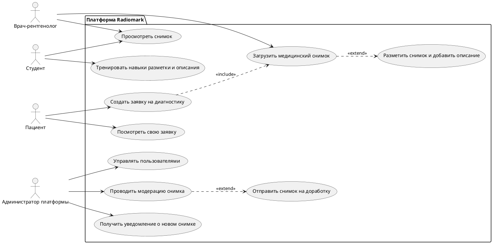

# Диаграмма прецедентов

Диаграмма показывает основных действующих лиц платформы и их ключевые сценарии использования. Она фиксирует границы системы и распределение обязанностей между ролями.

📋 Детальное описание прецедентов

**Основные акторы и их возможности:**

| Актор | Возможности в системе | Связанные UC |
|-------|----------------------|--------------|
| **Врач-рентгенолог** | Загружать медицинские снимки, выполнять их разметку и описание. Просматривать опубликованные снимки из базы. | [UC-03](../requirements/functional#uc-03-загрузка-разметка-и-описание-снимка-врачом-рентгенологом) |
| **Студент** | Просматривать учебные снимки для развития насмотренности, тренироваться в разметке на реальных кейсах, отслеживать свой прогресс. | [UC-02](../requirements/functional#uc-02-просмотр-рентгеновского-снимка-из-учебной-базы-данных) |
| **Пациент** | Создавать заявки на диагностику, загружать медицинские снимки, отслеживать статус заявки и получать заключение врача. | [UC-04](../requirements/functional#uc-04-отправка-пациентом-снимка-на-консультацию) |
| **Администратор** | Управлять учетными записями пользователей, проводить модерацию загруженных снимков, получать уведомления о новых снимках и отправлять их на доработку. | — |

**Ключевые связи между прецедентами:**

- **Загрузка снимка (UC1) → Разметка и описание (UC2):**  
  Каждая загрузка нового снимка обязательно включает его последующую разметку и описание врачом. Это отношение расширения (`extend`) — UC2 добавляет функциональность к базовому сценарию UC1.

- **Создание заявки пациентом (UC5) → Загрузка снимка (UC1):**  
  Для создания заявки на диагностику пациент должен загрузить медицинский снимок. Это отношение включения (`include`) — выполнение UC5 невозможно без выполнения UC1.

- **Модерация снимка (UC8) → Отправка на доработку (UC10):**  
  В процессе модерации администратор может принять решение вернуть снимок врачу на доработку. Это отношение расширения (`extend`) — UC10 выполняется только при определенных условиях в рамках UC8.

:::tip[Подробнее]

Детальное описание каждого Use Case с пошаговым алгоритмом, предусловиями и исключительными ситуациями вы найдете в разделе [Функциональные требования](../requirements/functional).

:::

